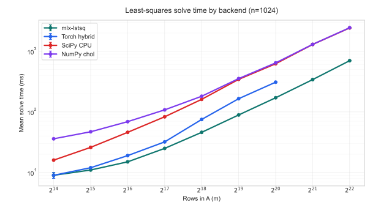

# mlx-lstsq

`mlx-lstsq` provides least-squares solvers for [MLX](https://github.com/ml-explore/mlx) backed by custom Apple Metal Performance Shaders kernels.

> This package is intended for well-conditioned least-squares problems with low matrix condition numbers. It uses a normal-equations-plus-Cholesky approach, so it is not a good fit for ill-conditioned systems.

## Requirements

- macOS on Apple Silicon
- Python 3.10 or newer
- `mlx>=0.31.1`
- Xcode command line tools

## Installation

```bash
pip install mlx-lstsq
```

The package contains a compiled extension module plus companion `.dylib` and `.metallib` assets, so installation happens from a wheel on supported systems or from source with a local toolchain.

## Usage

```python
import mlx.core as mx
import mlx_lstsq

A = mx.array([[1.0, 0.0], [1.0, 1.0], [1.0, 2.0]], dtype=mx.float32)
b = mx.array([1.0, 2.0, 2.5], dtype=mx.float32)

x = mlx_lstsq.solve(A, b)
ridge_x = mlx_lstsq.solve_ridge(A, b, 1e-3)
```

## Performance

The benchmark data in `examples/benchmark_solve_backends_n1024.csv` sweeps `m` from 16,384 to 4,194,304 with `n = 1024` and compares `mlx-lstsq` against a Torch MPS-plus-CPU hybrid path and CPU-only SciPy/NumPy Cholesky baselines.



Across the larger supported problem sizes in that sweep, `mlx-lstsq` is roughly 3.5x to 3.9x faster than the SciPy and NumPy CPU baselines, and about 1.6x to 1.9x faster than the Torch hybrid path before that backend becomes unsupported. You can regenerate the figure with `python3 examples/plot_benchmark_solve_backends.py`.

## Publishing Checklist

```bash
python3 -m pip install --upgrade build twine
python3 -m build
python3 -m twine check dist/*
python3 -m unittest discover -s tests -v
```

The smoke test installs the wheel from `dist/` into a fresh virtual environment and verifies a scalar solve, so it checks the publishable artifact instead of the source tree. Run that check on each supported Python version before publishing.
